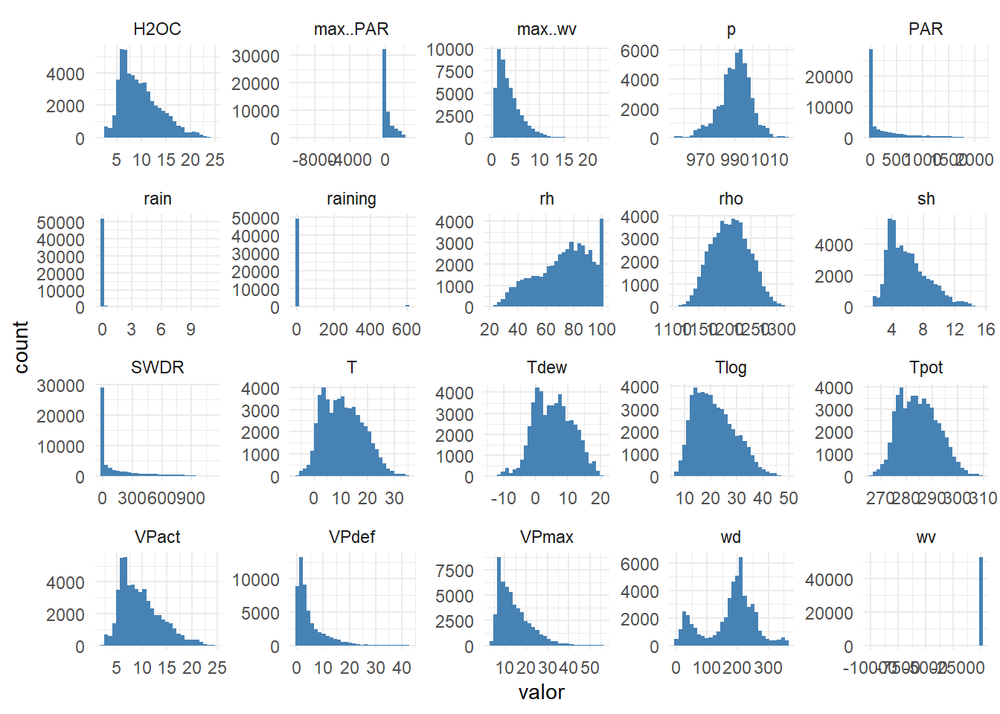
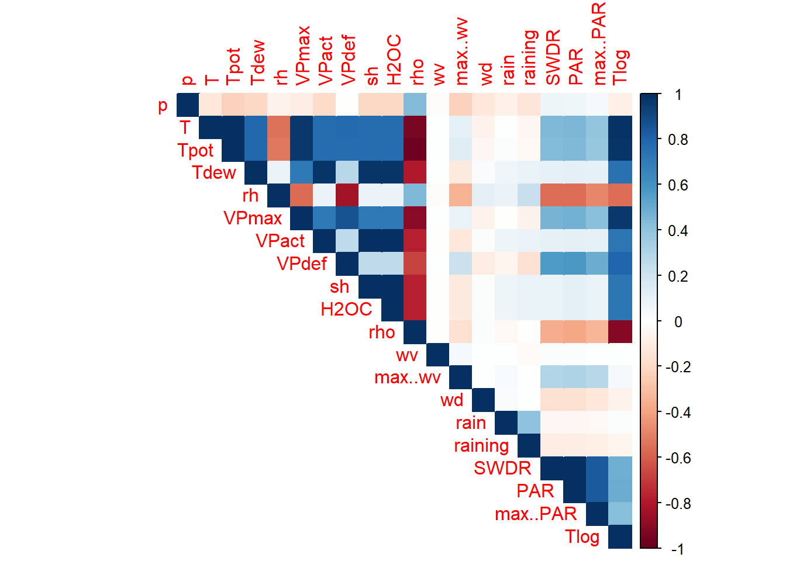
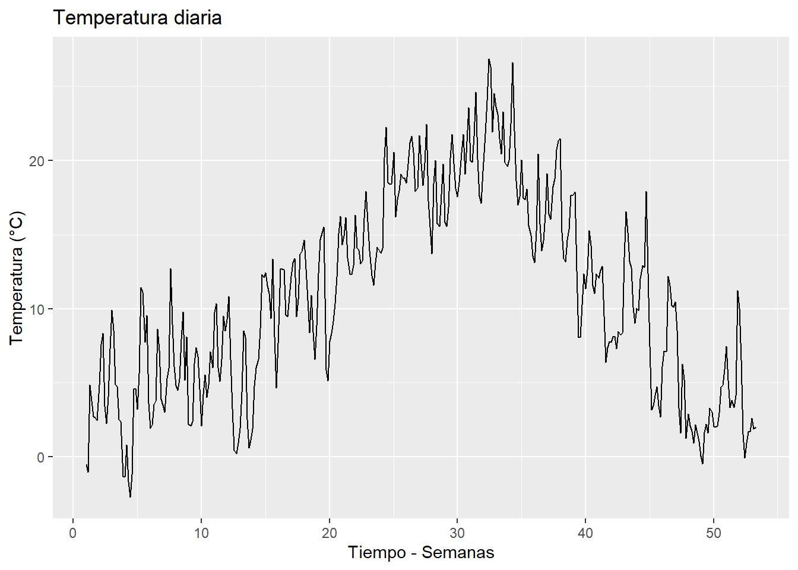
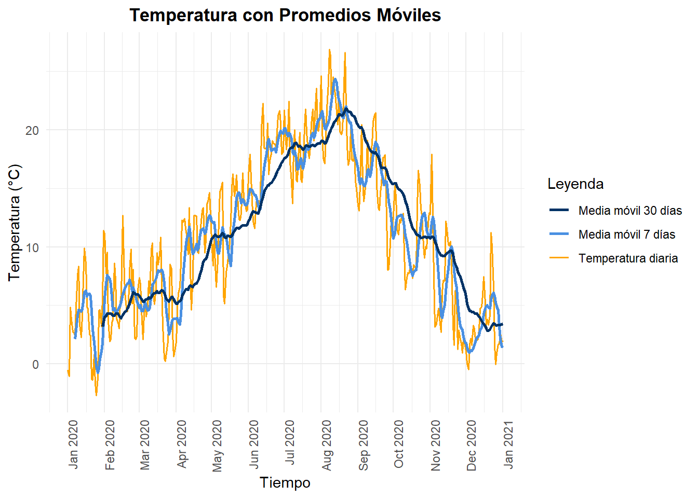
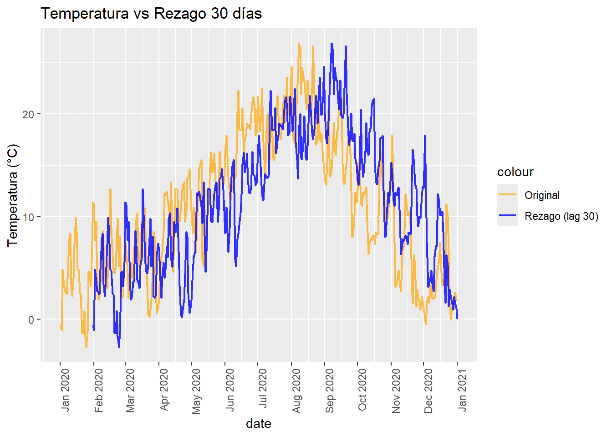
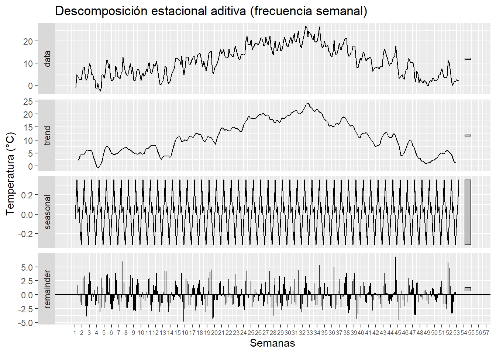

# Base de datos

La base de datos fue obtenida a partir de la plataforma kaggle en el siguiente link:

<https://www.kaggle.com/datasets/alistairking/weather-long-term-time-series-forecasting?resource=download>

El tiempo se registra cada 10 minutos durante todo el año 2020 y comprende 20 indicadores meteorológicos medidos en una estación meteorológica del Instituto Max Planck. El conjunto de datos proporciona mediciones atmosféricas completas que incluyen temperatura del aire, humedad, patrones de viento, radiación y precipitación. Con más de 52.560 puntos de datos por variable (365 días × 24 horas × 6 mediciones por hora), este muestreo de alta frecuencia ofrece información detallada sobre los patrones climáticos y las condiciones atmosféricas. Las mediciones incluyen tanto parámetros meteorológicos básicos como cantidades derivadas como el déficit de presión de vapor y la temperatura potencial, lo que las hace adecuadas tanto para la investigación meteorológica como para aplicaciones prácticas.

## Variables a trabajar

| **Siglas (Variable)** | **Descripción** |
|--------------------------|----------------------------------------------|
| date | Fecha y hora de la observación. |
| p | Presión atmosférica en milibares (mbar). |
| T | Temperatura del aire en grados Celsius (°C). |
| Tpot | Temperatura potencial en Kelvin (K), que representa la temperatura que tendría una masa de aire si se llevara a un nivel de presión estándar. |
| Tdew | Temperatura de punto de rocío en grados Celsius (°C), indica la temperatura a la cual el aire se satura de humedad. |
| rh | Humedad relativa en porcentaje (%), muestra la cantidad de humedad presente en el aire respecto al máximo que puede contener a esa temperatura. |
| VPmax | Presión máxima de vapor en milibares (mbar), representa la presión máxima ejercida por el vapor de agua a la temperatura dada. |
| VPact | Presión actual de vapor en milibares (mbar), indica la presión real ejercida por el vapor de agua en el aire. |
| VPdef | Déficit de presión de vapor en milibares (mbar), mide la diferencia entre la presión máxima y la actual, utilizada para evaluar el potencial de secado. |
| sh | Humedad específica en gramos por kilogramo (g/kg), muestra la masa de vapor de agua por kilogramo de aire. |
| H2OC | Concentración de vapor de agua en milimoles por mol (mmol/mol) de aire seco. |
| rho | Densidad del aire en gramos por metro cúbico (g/m³), refleja la masa de aire por unidad de volumen. |
| wv | Velocidad del viento en metros por segundo (m/s), mide el movimiento horizontal del aire. |
| max. wv | Velocidad máxima del viento en metros por segundo (m/s), indica la velocidad más alta registrada durante el período. |
| wd | Dirección del viento en grados (°), representa la dirección desde la cual sopla el viento. |
| rain | Precipitación total en milímetros (mm), muestra la cantidad de lluvia durante el período de observación. |
| raining | Duración de la lluvia en segundos (s), registra el tiempo total durante el cual ocurrió precipitación. |
| SWDR | Radiación solar de onda corta descendente en vatios por metro cuadrado (W/m²), mide la radiación solar entrante. |
| PAR | Radiación fotosintéticamente activa en micromoles por metro cuadrado por segundo (µmol/m²/s), indica la cantidad de luz disponible para la fotosíntesis. |
| max. PAR | Radiación fotosintéticamente activa máxima registrada durante el período de observación en µmol/m²/s. |
| Tlog | Temperatura registrada en grados Celsius (°C), posiblemente proveniente de un sensor o registrador secundario. |
| OT | Probablemente hace referencia a una “marca de tiempo operativa” o a un desfase temporal; puede requerir aclaración según el contexto del conjunto de datos. |

## Justificación de la selección de la base de datos

En este proyecto se trabajará con información meteorológica histórica proveniente del conjunto de datos Weather — Long Term Time Series Forecasting que fueron proporcionados por el Instituto Max Planck, que contiene registros diarios de variables climáticas como temperatura, humedad, velocidad del viento, radiación solar y presión atmosférica. Este tipo de información permite analizar el comportamiento del clima a lo largo del tiempo y desarrollar modelos de pronóstico que anticipen su evolución futura. Se enfocará en variables como la temperatura, la precipitación entre otras, por su impacto directo en sectores como la agricultura, la gestión del agua, la energía y la planificación urbana. Pronosticar estas variables es fundamental porque permite anticipar condiciones futuras, detectar patrones estacionales y reducir la incertidumbre en la toma de decisiones. Además, aporta valor agregado al facilitar la planificación de siembras, riegos y cosechas, mejorar la estimación de la demanda energética, prevenir riesgos ambientales y diseñar estrategias de adaptación frente al cambio climático. En conjunto, el análisis de esta base de datos permitirá generar información predictiva útil y de alto valor estratégico para distintos sectores económicos y ambientales.

# Lectura BD


``` r
# Cargar datos
df <- read.csv("cleaned_weather.csv")
```

## Librerias


``` r
#install.packages("forecast")
library(dplyr)
```

```
## Warning: package 'dplyr' was built under R version 4.4.3
```

```
## 
## Attaching package: 'dplyr'
```

```
## The following objects are masked from 'package:stats':
## 
##     filter, lag
```

```
## The following objects are masked from 'package:base':
## 
##     intersect, setdiff, setequal, union
```

``` r
library(ggplot2)
```

```
## Warning: package 'ggplot2' was built under R version 4.4.3
```

``` r
library(zoo)
```

```
## Warning: package 'zoo' was built under R version 4.4.3
```

```
## 
## Attaching package: 'zoo'
```

```
## The following objects are masked from 'package:base':
## 
##     as.Date, as.Date.numeric
```

``` r
library(tseries)
```

```
## Warning: package 'tseries' was built under R version 4.4.3
```

```
## Registered S3 method overwritten by 'quantmod':
##   method            from
##   as.zoo.data.frame zoo
```

``` r
library(forecast)
```

```
## Warning: package 'forecast' was built under R version 4.4.3
```

``` r
library(tidyr)
```

```
## Warning: package 'tidyr' was built under R version 4.4.3
```

``` r
library(corrplot)
```

```
## Warning: package 'corrplot' was built under R version 4.4.3
```

```
## corrplot 0.95 loaded
```

``` r
library(tidyverse)
```

```
## Warning: package 'tidyverse' was built under R version 4.4.2
```

```
## Warning: package 'tibble' was built under R version 4.4.3
```

```
## Warning: package 'readr' was built under R version 4.4.2
```

```
## Warning: package 'purrr' was built under R version 4.4.3
```

```
## Warning: package 'stringr' was built under R version 4.4.3
```

```
## Warning: package 'forcats' was built under R version 4.4.3
```

```
## Warning: package 'lubridate' was built under R version 4.4.2
```

```
## ── Attaching core tidyverse packages ──────────────────────── tidyverse 2.0.0 ──
## ✔ forcats   1.0.1     ✔ readr     2.1.5
## ✔ lubridate 1.9.4     ✔ stringr   1.5.2
## ✔ purrr     1.1.0     ✔ tibble    3.3.0
```

```
## ── Conflicts ────────────────────────────────────────── tidyverse_conflicts() ──
## ✖ dplyr::filter() masks stats::filter()
## ✖ dplyr::lag()    masks stats::lag()
## ℹ Use the conflicted package (<http://conflicted.r-lib.org/>) to force all conflicts to become errors
```

## Exploración de la base de datos

### Estructura del dataset


``` r
# Vista general
head(df)
```

```
##                  date       p    T   Tpot  Tdew   rh VPmax VPact VPdef   sh
## 1 2020-01-01 00:10:00 1008.89 0.71 273.18 -1.33 86.1  6.43  5.54  0.89 3.42
## 2 2020-01-01 00:20:00 1008.76 0.75 273.22 -1.44 85.2  6.45  5.49  0.95 3.39
## 3 2020-01-01 00:30:00 1008.66 0.73 273.21 -1.48 85.1  6.44  5.48  0.96 3.39
## 4 2020-01-01 00:40:00 1008.64 0.37 272.86 -1.64 86.3  6.27  5.41  0.86 3.35
## 5 2020-01-01 00:50:00 1008.61 0.33 272.82 -1.50 87.4  6.26  5.47  0.79 3.38
## 6 2020-01-01 01:00:00 1008.44 0.34 272.84 -1.54 87.1  6.26  5.45  0.81 3.37
##   H2OC     rho   wv max..wv    wd rain raining SWDR PAR max..PAR  Tlog
## 1 5.49 1280.62 1.02    1.60 224.3    0       0    0   0        0 11.45
## 2 5.45 1280.33 0.43    0.84 206.8    0       0    0   0        0 11.51
## 3 5.43 1280.29 0.61    1.48 197.1    0       0    0   0        0 11.60
## 4 5.37 1281.97 1.11    1.48 206.4    0       0    0   0        0 11.70
## 5 5.42 1282.08 0.49    1.40 209.6    0       0    0   0        0 11.81
## 6 5.41 1281.84 0.63    1.32 188.0    0       0    0   0        0 11.91
```

``` r
# Dimensiones
dim(df)
```

```
## [1] 52696    21
```

``` r
# Estructura de los datos
str(df)
```

```
## 'data.frame':	52696 obs. of  21 variables:
##  $ date    : chr  "2020-01-01 00:10:00" "2020-01-01 00:20:00" "2020-01-01 00:30:00" "2020-01-01 00:40:00" ...
##  $ p       : num  1009 1009 1009 1009 1009 ...
##  $ T       : num  0.71 0.75 0.73 0.37 0.33 0.34 0.19 0.03 0.11 0.22 ...
##  $ Tpot    : num  273 273 273 273 273 ...
##  $ Tdew    : num  -1.33 -1.44 -1.48 -1.64 -1.5 -1.54 -1.65 -1.7 -1.61 -1.62 ...
##  $ rh      : num  86.1 85.2 85.1 86.3 87.4 87.1 87.4 88.1 88.1 87.4 ...
##  $ VPmax   : num  6.43 6.45 6.44 6.27 6.26 6.26 6.19 6.12 6.16 6.2 ...
##  $ VPact   : num  5.54 5.49 5.48 5.41 5.47 5.45 5.41 5.39 5.43 5.42 ...
##  $ VPdef   : num  0.89 0.95 0.96 0.86 0.79 0.81 0.78 0.73 0.73 0.78 ...
##  $ sh      : num  3.42 3.39 3.39 3.35 3.38 3.37 3.34 3.33 3.35 3.35 ...
##  $ H2OC    : num  5.49 5.45 5.43 5.37 5.42 5.41 5.37 5.35 5.38 5.38 ...
##  $ rho     : num  1281 1280 1280 1282 1282 ...
##  $ wv      : num  1.02 0.43 0.61 1.11 0.49 0.63 0.88 1.05 0.9 0.62 ...
##  $ max..wv : num  1.6 0.84 1.48 1.48 1.4 1.32 1.28 1.64 1.72 1.04 ...
##  $ wd      : num  224 207 197 206 210 ...
##  $ rain    : num  0 0 0 0 0 0 0 0 0 0 ...
##  $ raining : num  0 0 0 0 0 0 0 0 0 0 ...
##  $ SWDR    : num  0 0 0 0 0 0 0 0 0 0 ...
##  $ PAR     : num  0 0 0 0 0 0 0 0 0 0 ...
##  $ max..PAR: num  0 0 0 0 0 0 0 0 0 0 ...
##  $ Tlog    : num  11.4 11.5 11.6 11.7 11.8 ...
```

Se realiza la conversión de la columna date a formato fecha


``` r
df$date <- as.Date(df$date)
```

### Análisis de valores faltantes


``` r
colSums(is.na(df))
```

```
##     date        p        T     Tpot     Tdew       rh    VPmax    VPact 
##        0        0        0        0        0        0        0        0 
##    VPdef       sh     H2OC      rho       wv  max..wv       wd     rain 
##        0        0        0        0        0        0        0        0 
##  raining     SWDR      PAR max..PAR     Tlog 
##        0        0        0        0        0
```

### Estadísticos descriptivos por variable


``` r
summary(df)
```

```
##       date                  p                T              Tpot      
##  Min.   :2020-01-01   Min.   : 955.6   Min.   :-6.44   Min.   :266.2  
##  1st Qu.:2020-04-01   1st Qu.: 984.8   1st Qu.: 4.59   1st Qu.:278.6  
##  Median :2020-07-02   Median : 990.9   Median :10.23   Median :284.3  
##  Mean   :2020-07-01   Mean   : 990.0   Mean   :10.82   Mean   :284.8  
##  3rd Qu.:2020-10-01   3rd Qu.: 995.9   3rd Qu.:16.18   3rd Qu.:290.3  
##  Max.   :2021-01-01   Max.   :1020.1   Max.   :34.80   Max.   :309.1  
##       Tdew                rh             VPmax           VPact       
##  Min.   :-13.8100   Min.   : 21.16   Min.   : 3.77   Min.   : 2.090  
##  1st Qu.:  0.7775   1st Qu.: 58.82   1st Qu.: 8.48   1st Qu.: 6.460  
##  Median :  5.2600   Median : 75.40   Median :12.48   Median : 8.890  
##  Mean   :  5.4091   Mean   : 72.49   Mean   :14.49   Mean   : 9.677  
##  3rd Qu.:  9.7000   3rd Qu.: 87.90   3rd Qu.:18.42   3rd Qu.:12.050  
##  Max.   : 20.5000   Max.   :100.00   Max.   :55.67   Max.   :24.160  
##      VPdef             sh              H2OC             rho      
##  Min.   : 0.00   Min.   : 1.300   Min.   : 2.090   Min.   :1107  
##  1st Qu.: 1.17   1st Qu.: 4.070   1st Qu.: 6.530   1st Qu.:1184  
##  Median : 2.74   Median : 5.610   Median : 8.990   Median :1211  
##  Mean   : 4.81   Mean   : 6.111   Mean   : 9.782   Mean   :1211  
##  3rd Qu.: 6.44   3rd Qu.: 7.620   3rd Qu.:12.200   3rd Qu.:1237  
##  Max.   :42.10   Max.   :15.400   Max.   :24.530   Max.   :1319  
##        wv               max..wv             wd             rain         
##  Min.   :-9999.000   Min.   : 0.000   Min.   :  0.0   Min.   : 0.00000  
##  1st Qu.:    1.000   1st Qu.: 1.770   1st Qu.:141.1   1st Qu.: 0.00000  
##  Median :    1.770   Median : 3.000   Median :195.5   Median : 0.00000  
##  Mean   :    1.996   Mean   : 3.633   Mean   :176.9   Mean   : 0.01177  
##  3rd Qu.:    2.920   3rd Qu.: 4.850   3rd Qu.:226.7   3rd Qu.: 0.00000  
##  Max.   :   13.770   Max.   :22.900   Max.   :360.0   Max.   :11.20000  
##     raining            SWDR              PAR             max..PAR       
##  Min.   :  0.00   Min.   :   0.00   Min.   :   0.00   Min.   :-9999.00  
##  1st Qu.:  0.00   1st Qu.:   0.00   1st Qu.:   0.00   1st Qu.:    0.00  
##  Median :  0.00   Median :   2.82   Median :   9.67   Median :   13.12  
##  Mean   : 25.91   Mean   : 131.33   Mean   : 259.86   Mean   :  308.60  
##  3rd Qu.:  0.00   3rd Qu.: 182.90   3rd Qu.: 366.44   3rd Qu.:  434.26  
##  Max.   :600.00   Max.   :1115.29   Max.   :2131.76   Max.   : 2498.94  
##       Tlog      
##  Min.   : 6.90  
##  1st Qu.:15.24  
##  Median :20.44  
##  Mean   :21.52  
##  3rd Qu.:26.82  
##  Max.   :49.09
```

``` r
df %>%
  select(-date) %>%
  summarise(across(everything(),
                   list(media = mean,
                        sd = sd,
                        min = min,
                        max = max),
                   na.rm = TRUE))
```

```
## Warning: There was 1 warning in `summarise()`.
## ℹ In argument: `across(...)`.
## Caused by warning:
## ! The `...` argument of `across()` is deprecated as of dplyr 1.1.0.
## Supply arguments directly to `.fns` through an anonymous function instead.
## 
##   # Previously
##   across(a:b, mean, na.rm = TRUE)
## 
##   # Now
##   across(a:b, \(x) mean(x, na.rm = TRUE))
```

```
##    p_media     p_sd  p_min   p_max  T_media     T_sd T_min T_max Tpot_media
## 1 989.9892 9.207149 955.58 1020.07 10.81824 7.468671 -6.44  34.8   284.7969
##    Tpot_sd Tpot_min Tpot_max Tdew_media  Tdew_sd Tdew_min Tdew_max rh_media
## 1 7.616995   266.19   309.13   5.409105 5.956722   -13.81     20.5 72.48713
##      rh_sd rh_min rh_max VPmax_media VPmax_sd VPmax_min VPmax_max VPact_media
## 1 19.23026  21.16    100    14.48705  7.63296      3.77     55.67    9.676828
##   VPact_sd VPact_min VPact_max VPdef_media VPdef_sd VPdef_min VPdef_max
## 1 4.023504      2.09     24.16    4.810131  5.53932         0      42.1
##   sh_media    sh_sd sh_min sh_max H2OC_media  H2OC_sd H2OC_min H2OC_max
## 1 6.111159 2.561536    1.3   15.4   9.782341 4.082684     2.09    24.53
##   rho_media   rho_sd rho_min rho_max wv_media    wv_sd wv_min wv_max
## 1  1210.883 36.43022 1107.38 1318.52 1.995935 43.59693  -9999  13.77
##   max..wv_media max..wv_sd max..wv_min max..wv_max wd_media    wd_sd wd_min
## 1      3.632807   2.462467           0        22.9 176.8503 81.19484      0
##   wd_max rain_media   rain_sd rain_min rain_max raining_media raining_sd
## 1    360 0.01177319 0.1232892        0     11.2      25.90747   111.5034
##   raining_min raining_max SWDR_media  SWDR_sd SWDR_min SWDR_max PAR_media
## 1           0         600   131.3318 215.7351        0  1115.29  259.8634
##     PAR_sd PAR_min PAR_max max..PAR_media max..PAR_sd max..PAR_min max..PAR_max
## 1 422.7865       0 2131.76       308.6019    569.9568        -9999      2498.94
##   Tlog_media Tlog_sd Tlog_min Tlog_max
## 1   21.51521 7.79062      6.9    49.09
```

### Distribución y correlaciones


``` r
df %>%
  select(-date) %>%
  pivot_longer(cols = everything(),
               names_to = "variable",
               values_to = "valor") %>%
  ggplot(aes(valor)) +
  geom_histogram(bins = 30, fill = "steelblue") +
  facet_wrap(~variable, scales = "free") +
  theme_minimal()
```




``` r
# Correlación entre variables climáticas

matriz_cor <- cor(df %>% select(-date), use = "complete.obs")
corrplot(matriz_cor, method = "color", type = "upper")
```



# Analisis de series

| Componente | Qué muestra |
|-------------------------|-----------------------------------------------|
| Serie original | Evolución completa con ruido |
| Promedio móvil | Suaviza la serie y revela la tendencia anual |
| Rezago | Muestra dependencia temporal (temperatura de hoy depende de la de ayer) |
| Estacionalidad | Patrón repetitivo semanal en el clima |

## Serie original (diaria)


``` r
# Promediar por día (en caso de que haya datos horarios)
daily <- df %>%
  group_by(date) %>%
  summarise(T = mean(T, na.rm = TRUE))

# Convertir a serie temporal (frecuencia diaria)
ts_T <- ts(daily$T, frequency = 7)  # 7 para capturar estacionalidad semanal
```


``` r
# Gráfico de la serie original
autoplot(ts_T) +
  ggtitle("Temperatura diaria") +
  xlab("Tiempo - Semanas") + ylab("Temperatura (°C)")
```



## Promedio móvil (Media Móvil 7 días)


``` r
# Promedios móviles
daily$MA7 <- rollmean(daily$T, k = 7, fill = NA, align = "right")
daily$MA30 <- rollmean(daily$T, k = 30, fill = NA, align = "right")
```


``` r
ggplot(daily, aes(x = date)) +
  geom_line(aes(y = T, color = "Temperatura diaria"), size = 0.6) +
  geom_line(aes(y = MA7, color = "Media móvil 7 días"), size = 1) +
  geom_line(aes(y = MA30, color = "Media móvil 30 días"), size = 1) +
  labs(
    title = "Temperatura con Promedios Móviles",
    x = "Tiempo",
    y = "Temperatura (°C)",
    color = "Leyenda"
  ) +
  scale_color_manual(
    values = c(
      "Temperatura diaria" = "orange",
      "Media móvil 7 días" = "#4A90E2",
      "Media móvil 30 días" = "#003366"
    )
  ) +
  scale_x_date(
    date_breaks = "1 month",
    date_labels = "%b %Y"
  ) +
  theme_minimal() +
  theme(
    axis.text.x = element_text(angle = 90, hjust = 1),  # rotar etiquetas de fechas para mejor lectura
    plot.title = element_text(hjust = 0.5, face = "bold")  # centrar título y negrita
  )
```

```
## Warning: Using `size` aesthetic for lines was deprecated in ggplot2 3.4.0.
## ℹ Please use `linewidth` instead.
## This warning is displayed once every 8 hours.
## Call `lifecycle::last_lifecycle_warnings()` to see where this warning was
## generated.
```

```
## Warning: Removed 6 rows containing missing values or values outside the scale range
## (`geom_line()`).
```

```
## Warning: Removed 29 rows containing missing values or values outside the scale range
## (`geom_line()`).
```



| Serie        | Qué muestra                                                  |
|--------------------|----------------------------------------------------|
| T (original) | fluctuaciones reales día a día (ruido)                       |
| MA7          | tendencia suave a corto plazo, reduce variabilidad semanal   |
| MA30         | tendencia general del clima, eliminando ruido de corto plazo |

Con el promedio móvil se observa que la serie de temperatura presenta fluctuaciones diarias importantes, pero mantiene una tendencia más clara cuando se suaviza con ventanas móviles de 7 y 30 días. La MA7 revela variaciones semanales, mientras que la MA30 permite ver la tendencia de fondo eliminando gran parte del ruido diario, facilitando la detección de ciclos y patrones a mayor escala.

## Rezagos (Lag 30 días)


``` r
daily$T_lag1 <- lag(daily$T, 30)

ggplot(daily, aes(x = date)) +
  geom_line(aes(y = T, color = "Original"), alpha = 0.7, size = 0.8) +
  geom_line(aes(y = T_lag1, color = "Rezago (lag 30)"), alpha = 0.8, size = 0.8) +
  ggtitle("Temperatura vs Rezago 30 días") +
  ylab("Temperatura (°C)") +
  scale_color_manual(values = c("Original" = "orange", "Rezago (lag 30)" = "blue")) +
  scale_x_date(date_breaks = "1 months", date_labels = "%b %Y") +
  theme(axis.text.x = element_text(angle = 90, hjust = 1))
```

```
## Warning: Removed 30 rows containing missing values or values outside the scale range
## (`geom_line()`).
```



La línea naranja representa los valores reales de temperatura día a día, mientras que la línea azul muestra la misma serie desplazada 30 días, es decir, con un rezago de un mes. Ambas curvas presentan un patrón estacional claro, con incrementos en verano y descensos en invierno. La similitud entre la serie original y su rezago confirma una fuerte dependencia temporal a 30 días, evidenciando autocorrelación en los datos. Este comportamiento indica que la temperatura sigue un patrón continuo y predecible a lo largo del tiempo, lo que es fundamental para entender su dinámica.


## Descomposición estacional


``` r
descomp <- decompose(ts_T, type = "additive")
```


``` r
autoplot(descomp) +
  labs(
    title = "Descomposición estacional aditiva (frecuencia semanal)",
    x = "Semanas",
    y = "Temperatura (°C)"
  ) +
  scale_x_continuous(
    breaks = seq(1, length(ts_T), by = 1),           # cada semana
    labels = seq(1, length(ts_T), by = 1)            # etiquetas semanales
  ) +
  theme(
    axis.text.x = element_text(size = 6)    # tamaño más pequeño
  )
```

```
## Scale for x is already present.
## Adding another scale for x, which will replace the existing scale.
```



data → la serie original

trend → la tendencia a largo plazo

seasonal → los patrones que se repiten (por ejemplo, cada año o cada mes)

remainder → el ruido o variación aleatoria

La serie presenta un patrón estacional claro: las temperaturas aumentan progresivamente hacia los meses de verano y disminuyen en invierno, reflejando una tendencia anual marcada. La descomposición estacional aditiva permite separar tres componentes principales: la tendencia, que captura el aumento y disminución de la temperatura a lo largo del año; la estacionalidad, que refleja la repetición cíclica de estos comportamientos cada año; y el residuo, que presenta fluctuaciones pequeñas y sin patrón definido, indicando que la tendencia y la estacionalidad explican la mayor parte de la dinámica de la serie.
